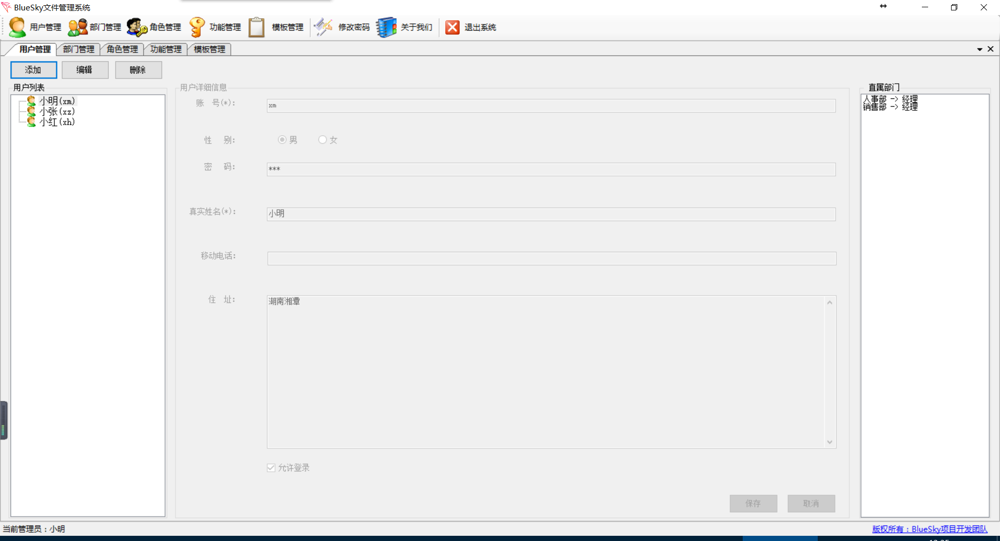
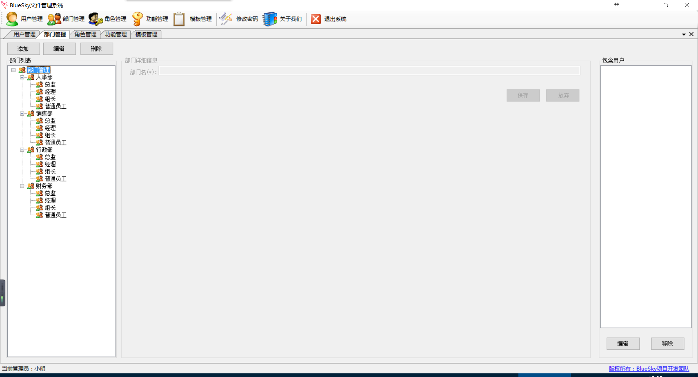

# BlueSky文件管理系统后台
* [BlueSky文件管理系统](#bluesky文件管理系统)
    * [总体结构图](#总体结构图)
    * [数据库结构](#数据库结构)
    * [用户登录](#用户登录)
    * [用户管理](#用户管理)
    * [部门管理](#部门管理)
    * [角色管理](#角色管理)
    * [功能管理](#功能管理)
## 总体结构图

## 数据库结构
SQL脚本文件位于Database Design目录，其中db.sql是数据库文件，data.sql是数据

## 用户登录

## 用户管理
* 添加编辑删除用户

* 查看用户所在岗位

  

## 部门管理

- 添加编辑删除部门

- 查看岗位下包含的用户

## 角色管理

- 添加编辑删除角色
- 角色分配权限
- 编辑角色包含用户

## 功能管理

* 添加编辑删除权限

  ​

